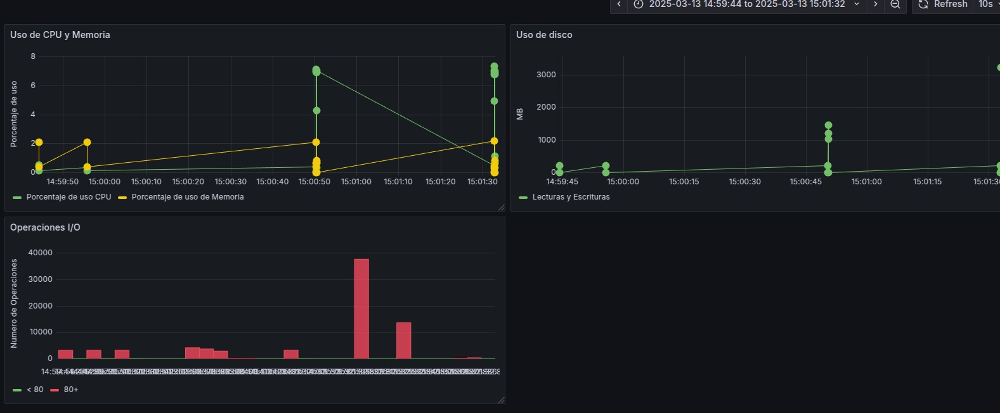
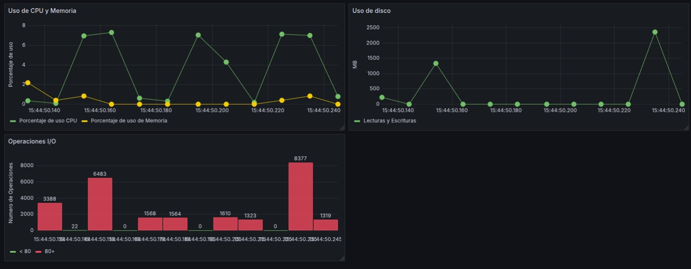

# Proyectos_SO1
## Arranque del proyecto
### Grafana
#### Es necesario activar un servidor de grafana asi:
``` bash
docker run -d -p 3000:3000 --name=grafana grafana/grafana
```
#### Despues es necesario acceder localmente a esta direccion http://localhost:3000.

#### Descargar el plugin de infinity y abrir un nuevo dashboard y darle en importar y ahi pegar el json que esta en la carpeta Grafana de este proyecto.


### Servicio rust

#### Al tener activo grafana solo queda levantar el servicio en la carpeta server de este proyecto el siguiente comando.


``` bash
cargo run
```

#### con eso ya se podrán visualizar las gráficas en el dashboard configurado.





### Parar servicio

#### Para terminar los procesos de forma adecuado solo oprimir ctrl + c, con ello se pararan todas las configuraciones.

## Configuraciones

### Crear entorno arch para pip
#### python -m venv entorno      --> crear entorno
#### source entorno/bin/activate --> entrar al entorno
#### deactivate

### Comandos modulo Kernel

#### cd module
#### make
#### sudo insmod sysinfo_202113580.ko
#### sudo dmesg | tail
#### cat /proc/sysinfo_202113580 --> visualizar
#### sudo rmmod sysinfo_202113580 --> desinstalar

### Logs
#### sudo docker build -t dockerfile . --> generar imagen
#### docker run -d -p 8000:8000 dockerfile --> ejecutar imagen

#### docker start id_conteiner
#### docker stop id_conteiner

### Cgroups
#### /sys/fs/cgroup/system.slice/docker-id.scope/
#### docker rm $(docker ps -a -q) --> borrar contenedores

## Explicación
### Funciones de obtención de datos
#### Por medio de los cgroups es posible encontrar datos de los contenedores específicos por ende se lee el archivo específico con su id para hacer los respectivos cálculos.

``` c
static char* get_Uso_Memoria(const char *container_id, unsigned long totalram) {
    char path[BUFFER_SIZE], buffer[BUFFER_SIZE];
    unsigned long long mem_usage = 0;
    unsigned long long porcent_mem_usage = 0;
    char *result;

    snprintf(path, sizeof(path), "/sys/fs/cgroup/system.slice/docker-%s.scope/memory.current", container_id);
    
    if (Leer_Archivo(path, buffer, sizeof(buffer)) > 0) {
        sscanf(buffer, "%llu", &mem_usage);
    }

    mem_usage /= (1024 * 1024);
    totalram /= 1024;

    if (totalram > 0) {
        porcent_mem_usage = (mem_usage * 10000) / totalram;
    }

    result = kmalloc(32, GFP_KERNEL);
    if (!result) return NULL;

    snprintf(result, 32, "%llu.%02llu", porcent_mem_usage / 100, porcent_mem_usage % 100);
    return result;
}

static char* get_Uso_CPU(const char *container_id) {
    char path[BUFFER_SIZE], buffer[BUFFER_SIZE];
    unsigned long long usage_usec_1 = 0, usage_usec_2 = 0;
    char *result;

    snprintf(path, sizeof(path), "/sys/fs/cgroup/system.slice/docker-%s.scope/cpu.stat", container_id);

    if (Leer_Archivo(path, buffer, sizeof(buffer)) <= 0) return NULL;
    sscanf(buffer, "usage_usec %llu", &usage_usec_1);

    msleep(700);  // Esperamos al cambio

    if (Leer_Archivo(path, buffer, sizeof(buffer)) <= 0) return NULL;
    sscanf(buffer, "usage_usec %llu", &usage_usec_2);

    unsigned long long delta_usage = usage_usec_2 - usage_usec_1;
    unsigned long long cpu_usage = (delta_usage) / 100;

    result = kmalloc(32, GFP_KERNEL);
    if (!result) return NULL;

    snprintf(result, 32, "%llu.%02llu", cpu_usage / 100, cpu_usage % 100);
    return result;
}

static char* get_Uso_Disco(const char *container_id) {
    char path[BUFFER_SIZE], buffer[BUFFER_SIZE];
    unsigned long long rbytes = 0, wbytes = 0, total_Uso = 0;
    char *result;

    snprintf(path, sizeof(path), "/sys/fs/cgroup/system.slice/docker-%s.scope/io.stat", container_id);
    
    if (Leer_Archivo(path, buffer, sizeof(buffer)) > 0) {
        char *rbytes_pos = strstr(buffer, "rbytes=");
        if (rbytes_pos) {
            rbytes_pos += strlen("rbytes=");
            sscanf(rbytes_pos, "%llu", &rbytes);
        }

        char *wbytes_pos = strstr(buffer, "wbytes=");
        if (wbytes_pos) {
            wbytes_pos += strlen("wbytes=");
            sscanf(wbytes_pos, "%llu", &wbytes);
        }
    }

    rbytes /= (1024 * 1024);
    wbytes /= (1024 * 1024);
    total_Uso = rbytes+wbytes;

    // Reservar memoria para el resultado
    result = kmalloc(64, GFP_KERNEL);
    if (!result) return NULL;

    snprintf(result, 64, "%llu", total_Uso); // MB

    return result;
}


static char* get_Uso_IO(const char *container_id) {
    char path[BUFFER_SIZE], buffer[BUFFER_SIZE];
    unsigned long long rios = 0, wios = 0, total_ops = 0;
    char *result;

    snprintf(path, sizeof(path), "/sys/fs/cgroup/system.slice/docker-%s.scope/io.stat", container_id);

    if (Leer_Archivo(path, buffer, sizeof(buffer)) > 0) {
        char *rios_pos = strstr(buffer, "rios=");
        if (rios_pos) {
            rios_pos += strlen("rios="); 
            sscanf(rios_pos, "%llu", &rios); 
        }

        char *wios_pos = strstr(buffer, "wios=");
        if (wios_pos) {
            wios_pos += strlen("wios=");
            sscanf(wios_pos, "%llu", &wios); 
        }
    }

    total_ops = rios+wios;

    result = kmalloc(64, GFP_KERNEL);
    if (!result) return NULL;

    snprintf(result, 64, "%llu", total_ops);

    return result;
}
```

### Generación de configuración Json
#### Para visualizar la información es necesario formaterlo como json con los task_struct y realizar cálculos generales de la computadora y ahi mismo se aplican las funciones de obtencion de datos.

``` c
static int sysinfo_show(struct seq_file *m, void *v) { // Mostrar en el proc
    struct sysinfo si;
    struct task_struct *task;  // recorrer procesos
    int first_process = 1;   // Saber primer proceso
    unsigned long total_jiffies = jiffies; // tiempo total cpu
    si_meminfo(&si);
    // Conversion a kB
    unsigned long totalram = si.totalram * (PAGE_SIZE / 1024); 
    unsigned long freeram = si.freeram * (PAGE_SIZE / 1024); 
    unsigned long ram_usada = totalram - freeram;

    seq_printf(m, "  {\n");
    seq_printf(m, "\"SystemInfo\": \n");
    seq_printf(m, "  {\n");
    seq_printf(m, "    \"RAM_Total\": %lu,\n", totalram);
    seq_printf(m, "    \"RAM_Libre\": %lu,\n", freeram);
    seq_printf(m, "    \"Uso_RAM\": %lu,\n", ram_usada);
    seq_printf(m, "    \"Uso_CPU\": %lu\n", total_jiffies);
    seq_printf(m, "  },\n");
    seq_printf(m, "\"Processes\": [\n");

    // Iteramos sobre los procesos
    for_each_process(task)
    {
        if (strcmp(task->comm, "containerd-shim") == 0) {
            unsigned long totalram = si.totalram * 4;
            char *cmdline = NULL;
            
            cmdline = get_process_cmdline(task);

            if (!first_process) {
                seq_printf(m, ",\n");
            } else {
                first_process = 0;
            }
            
            char *id_Contenedor = extraer_id(cmdline);
            char *disk_usage = get_Uso_Disco(id_Contenedor);
            char *cpu_usagep = get_Uso_CPU(id_Contenedor);
            char *mem_usagep = get_Uso_Memoria(id_Contenedor, totalram);
            char *ops_IO_usage = get_Uso_IO(id_Contenedor);

            seq_printf(m, "  {\n");
            seq_printf(m, "    \"PID\": %d,\n", task->pid);
            seq_printf(m, "    \"Name\": \"%s\",\n", task->comm);
            seq_printf(m, "    \"Cmdline\": \"%s\",\n", cmdline ? cmdline : "N/A");
            seq_printf(m, "    \"Porcentaje de uso Memoria\": %s,\n",mem_usagep );
            seq_printf(m, "    \"Porcentaje de uso CPU\": %s,\n", cpu_usagep);
            seq_printf(m, "    \"Uso de disco\": %s,\n", disk_usage);
            seq_printf(m, "    \"Operaciones I/O\": %s\n", ops_IO_usage);
            seq_printf(m, "  }");

            // liberamos la memoria
            Liberar_Memoria(disk_usage);
            Liberar_Memoria(mem_usagep);
            Liberar_Memoria(cpu_usagep);
            Liberar_Memoria(ops_IO_usage);
            // Liberamos la memoria de la línea de comandos
            if (cmdline) {
                kfree(cmdline);
            }
        }
    }

    seq_printf(m, "\n]\n}\n");
    return 0;
}

```
## Aplicación de la arquitectura

#### Ene el servicio rust arrancamos los servicios necesarios, y crea los contenedores en el cronjob y borrar los contenedores sobrantes para solo tener cuatro contenedores de cada tipo.

``` rust
fn main() -> Result<(), Box<dyn std::error::Error>> {
    let asin = tokio::runtime::Runtime::new()?; // funciones asincrónicas

    let cliente = reqwest::blocking::Client::new();
    
    let corriendo = Arc::new(AtomicBool::new(true));{ // Controlar ciclo
        let corriendo = corriendo.clone();
        let cliente_clone = cliente.clone(); // Clonamos el cliente para usarlo en el handler
        ctrlc::set_handler(move || {
            println!("Parando ciclo . . .");
            let _ = set_crontab(0); // borramos crontab
            corriendo.store(false, Ordering::SeqCst);
        })?;
    }
    set_crontab(1)?; // crear el cronjob para generar cronjob
    log_conteiner(1)?; // Creamos el contenedor con el servicio python
    Ejecutar_Modulo_Kernel()?; 
    while corriendo.load(Ordering::SeqCst) {  // Romper bucle con ctrl+c     
        
        limpiar_contenedores();

        match get_sysinfo_json() {
            Ok(json_str) => {
                match Deserializar_Json_Y_Formatear(&json_str) {
                    Ok(json_formateado) => {
                        println!("{}", serde_json::to_string_pretty(&json_formateado).unwrap());
                        if let Err(e) = asin.block_on(enviar_datos(&json_formateado.to_string())) {
                            println!("Error enviando datos: {}", e);
                        }
                    },
                    Err(e) => println!("Error transformando JSON: {}", e),
                }
            },
            Err(e) => println!("Error obteniendo JSON: {}", e),
        }
        
// post mandar json actualizado
        //     - Ver contenedores activos
        //     - Comparar con la regla de "debe haber 1 contenedor de cada tipo"
        //     - Eliminar contenedores sobrantes o viejos
      
        /*let response = match cliente.post("http://127.0.0.1:8000/logs")
            .header("Content-Type", "application/json")
            .body(sys_info_json)
            .send()
        {
            Ok(resp) => resp,
            Err(e) => {
                println!("Error en la petición HTTP: {:?}", e);

                continue;
            }
        };*/

        //println!("Response: {:?}", response);
        //println!("Memoria usada: {} MB", sys_info.mem_used);

        thread::sleep(Duration::from_secs(10)); // delay 10 segundos para no saturar
    }
    Limpiar_Modulo_Kernel()?;
    set_crontab(0)?; // borramos crontab al salir
    log_conteiner(0)?; // paramos el contenedor
    Ok(())
}
```